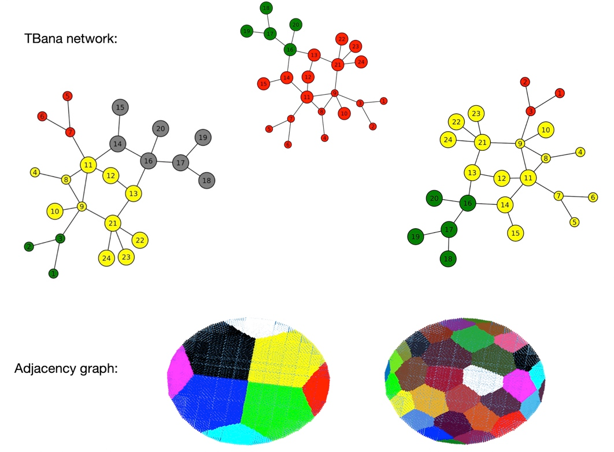

# SpectralClusteringMPI
This repository contains a parallel implementation of the spectral clustering algorithm in C using MPI. It contains the following files:
+ SpectralClustering_timing.c: file used for timing
+ SpectralClustering_WithOutput.c: file used to create the results
+ TBana: results for partitioning the Stockholm TBana network
+ PDE: results for partitioning an adjacency graph belonging to a sparse matrix related to  PDE
+ inputs: folder containing the input Laplacians for testing, timing and both applications

